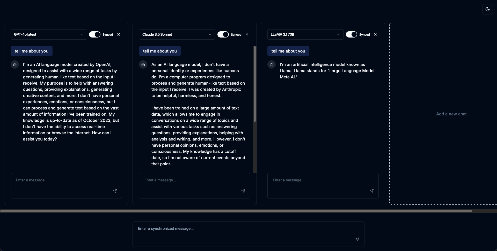

# Multi LLM Runner

This is a simple web application that allows you to run multiple Large Language Models (LLMs) in parallel.



## Features

- Simultaneous use of multiple chat interfaces
- Option to select different LLM models for each chat
- Ability to synchronize input across chats
- Toggle between dark and light modes

## Technologies Used

- React
- Next.js
- TypeScript
- Tailwind CSS
- shadcn/ui components
- Vercel AI SDK

## Getting Started

1. Clone the repository:

   ```
   git clone https://github.com/komzweb/multi-llm-runner.git
   ```

2. Install dependencies:

   ```
   cd multi-llm-runner
   npm install
   ```

3. Start the development server:

   ```
   npm run dev
   ```

4. Open `http://localhost:3000` in your browser.

## Environment Variables

Before running the application, set up the following environment variables:

- `OPENAI_API_KEY`: Your OpenAI API key
- `ANTHROPIC_API_KEY`: Your Anthropic API key
- `GOOGLE_GEMINI_API_KEY`: Your Google Gemini API key
- `GROQ_API_KEY`: Your Groq API key

## Missing Features

The current application lacks the following features:

- Multimodal support
- Markdown to HTML conversion
- Saving conversation history to a database
- Adjustable message input area
- And more

## Contributing

Pull requests are welcome. For major changes, please open an issue first to discuss what you would like to change.

## License

[MIT](https://choosealicense.com/licenses/mit/)
